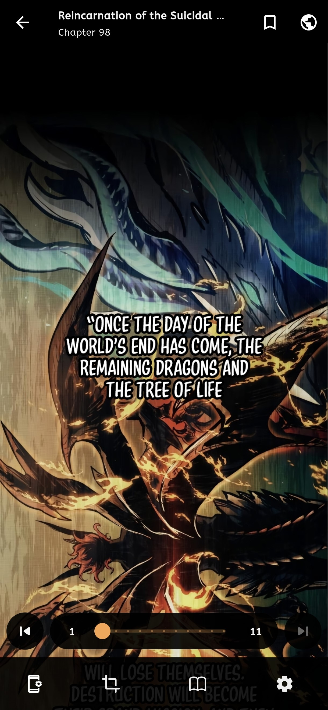
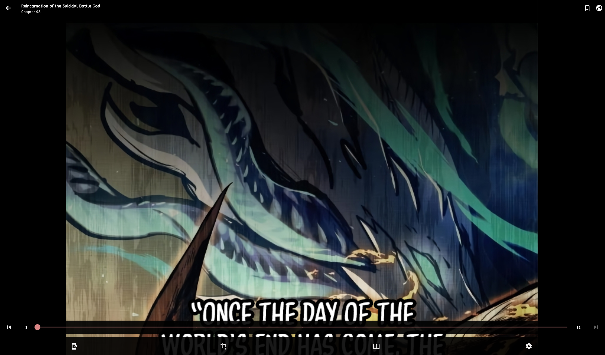

 

<h1 align="center"> Mangayomi </h1>

 
  

Mangayomi is free an open source manga reader and anime streaming cross-plateform app inspired by Tachiyomi and Aniyomi made with Flutter. It allows users to read manga and watch anime from a variety of sources.

## Features

Features include:
* [Supports external sources](https://github.com/kodjodevf/mangayomi-extensions), utilizing the capabilities of the [dart_eval](https://pub.dev/packages/dart_eval) package & [flutter_qjs package A small Javascript engine supports ES2020](https://github.com/kodjodevf/flutter_qjs)
* Online reading from a variety of sources
* Watching anime from a variety of sources
* Local reading of downloaded content
* A configurable reader with multiple viewers, reading directions and other settings..
* Tracker support for anime and manga: [MyAnimeList](https://myanimelist.net/), [AniList](https://anilist.co/) and [Kitsu](https://kitsu.io/) support
* Categories to organize your library
* Light and dark themes
* Create backups locally to read offline or to your desired cloud service

## Screenshots :camera:

### Mobile Screenshots                                                                                                                
|          |  Reader                                               |  Player                                               |
| -------- | ----------------------------------------------------- | ----------------------------------------------------- |
| Views    |  |  |

### Desktop Screenshots                                                                                                                
|          |  Reader                                           |  Player                                           |
| -------- | ------------------------------------------------- | ------------------------------------------------- |
| Views    |  |  |

## Download
Get the app from our [releases page](https://github.com/kodjodevf/mangayomi/releases).

# Contributing

Contributions are welcome!

To get started with extension development, see [CONTRIBUTING-DART.md](https://github.com/kodjodevf/mangayomi-extensions/blob/main/CONTRIBUTING-DART.md) for create sources in Dart or [CONTRIBUTING-JS.md](https://github.com/kodjodevf/mangayomi-extensions/blob/main/CONTRIBUTING-JS.md) for create sources in JavaScript.

## License

    Copyright 2023 Moustapha Kodjo Amadou

    Licensed under the Apache License, Version 2.0 (the "License");
    you may not use this file except in compliance with the License.
    You may obtain a copy of the License at

    http://www.apache.org/licenses/LICENSE-2.0

    Unless required by applicable law or agreed to in writing, software
    distributed under the License is distributed on an "AS IS" BASIS,
    WITHOUT WARRANTIES OR CONDITIONS OF ANY KIND, either express or implied.
    See the License for the specific language governing permissions and
    limitations under the License.
    

## Disclaimer

The developer of this application does not have any affiliation with the content providers available.
