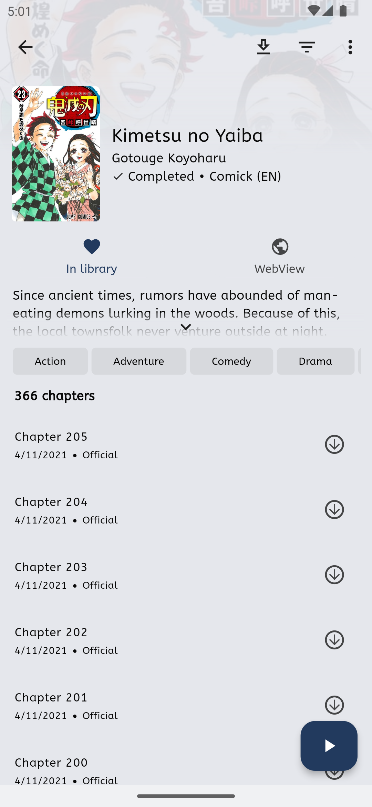
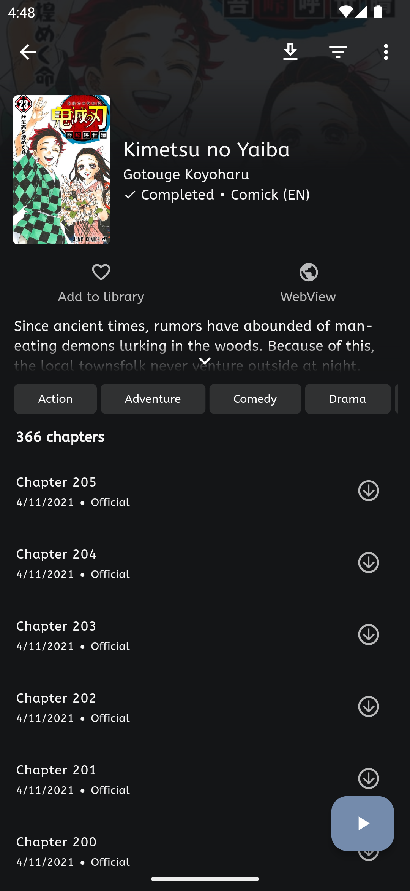
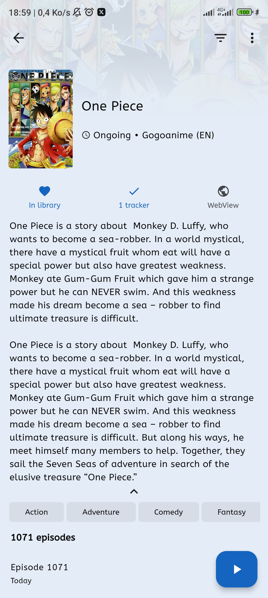
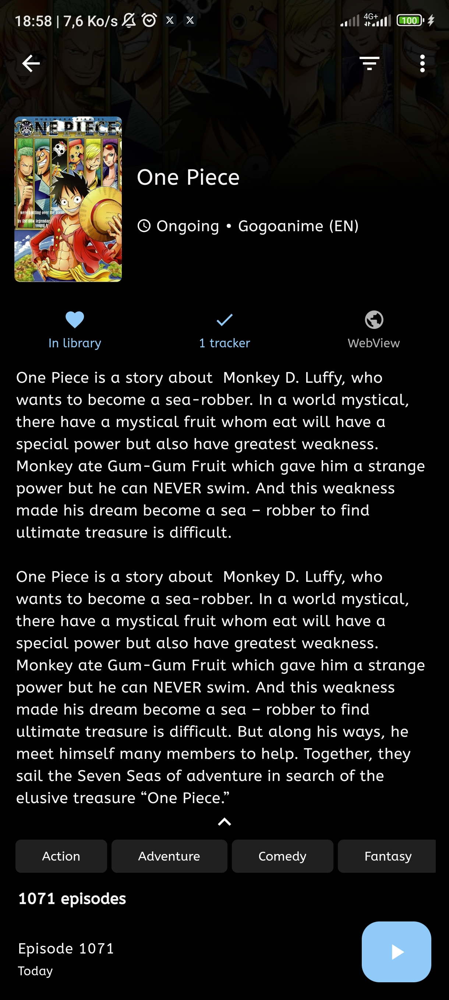
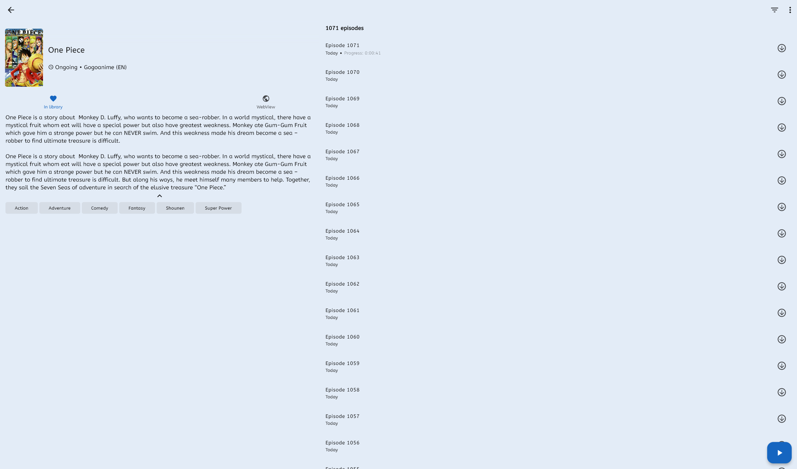
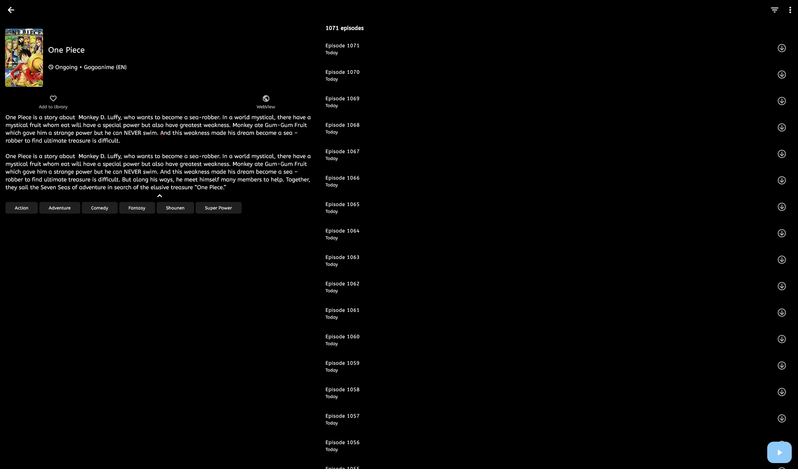

 

<h1 align="center"> Mangayomi </h1>

Mangayomi is free an open source manga reader and anime streaming cross-plateform app inspired by Tachiyomi made with Flutter. It allows users to read manga and watch anime from a variety of sources.

## Features

Features include:
* [Supports external sources](https://github.com/kodjodevf/mangayomi-extensions)
* Online reading from a variety of sources
* Watch anime from a variety of sources
* Local reading of downloaded content
* Read and manage local archives (.cbz, .zip)
* Watch and manage local Anime
* A configurable reader with multiple viewers, reading directions.
* Tracker support for anime and manga: [MyAnimeList](https://myanimelist.net/) and [AniList](https://anilist.co/) support
* Categories to organize your library
* Light and dark themes

## Screenshots :camera:

### Mobile Screenshots                                                                                                                
| Views    |  Light                                                     |  Dark                                                        |
| -------- | ---------------------------------------------------------- | ------------------------------------------------------------ |
| Manga    |       |      |
| Anime    |       |      |
| Reader   |     | |
| Player   |  ||

### Desktop Screenshots                                                                                                                
| Views    |  Light                                                     |  Dark                                                        |
| -------- | ---------------------------------------------------------- | ------------------------------------------------------------ |
| Manga    |       |      |
| Anime    |       |      |
| Reader   |     | |
| Player   |  ||

## Download
Get the app from our [releases page](https://github.com/kodjodevf/mangayomi/releases).

## License

    Copyright 2023 Moustapha Kodjo Amadou

    Licensed under the Apache License, Version 2.0 (the "License");
    you may not use this file except in compliance with the License.
    You may obtain a copy of the License at

    http://www.apache.org/licenses/LICENSE-2.0

    Unless required by applicable law or agreed to in writing, software
    distributed under the License is distributed on an "AS IS" BASIS,
    WITHOUT WARRANTIES OR CONDITIONS OF ANY KIND, either express or implied.
    See the License for the specific language governing permissions and
    limitations under the License.

## Disclaimer

The developer of this application does not have any affiliation with the content providers available.
