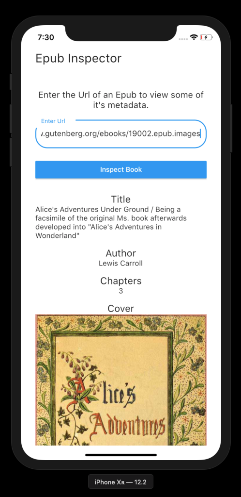
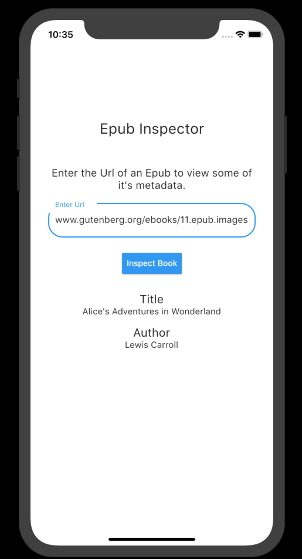

# flutter_ex

A sample application that fetches an epub from a given URL and displays the Title and Author

Place a URL in the text box (e.g. https://www.gutenberg.org/ebooks/11.epub.images), hit the "Inspect Book" button and watch the application download the book and extract some relevant information.

## Examples

### With Cover Image

### Without Cover Image

